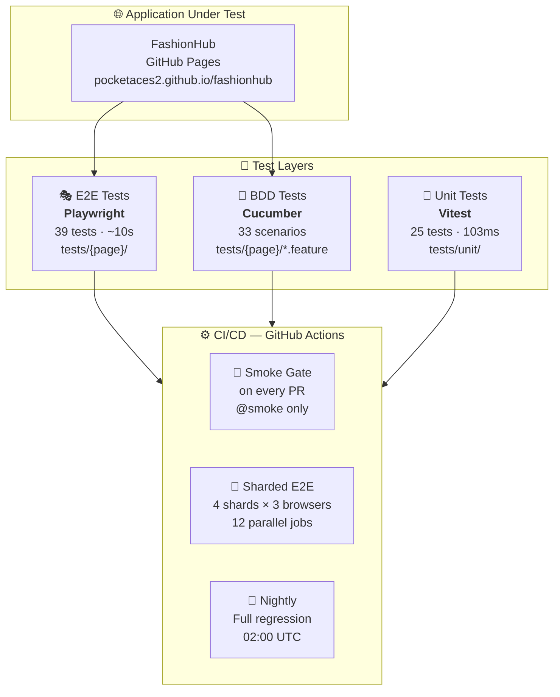
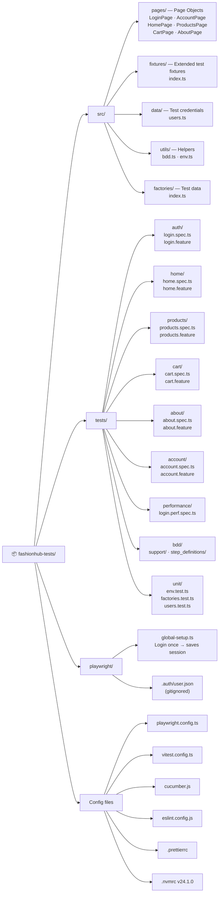
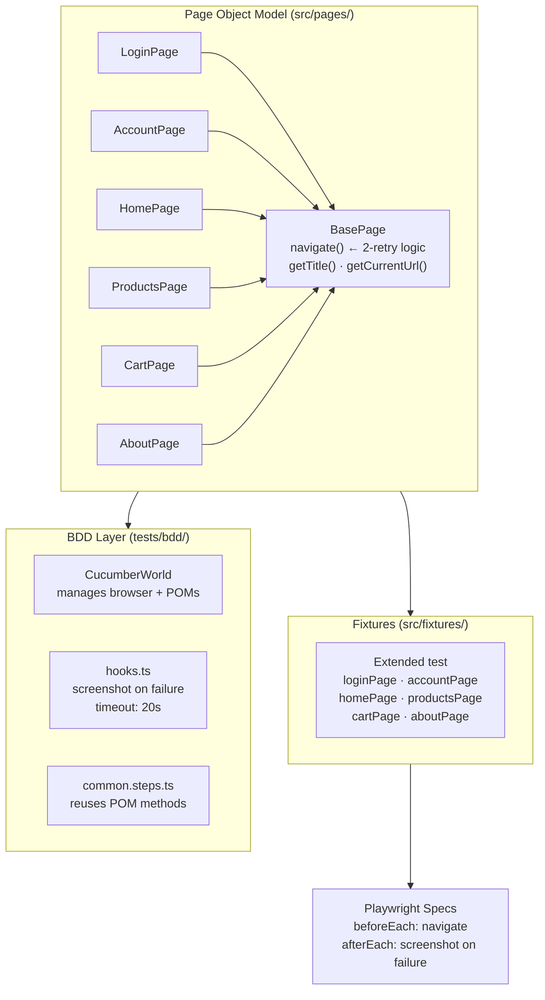
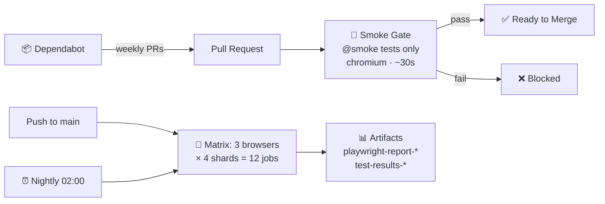
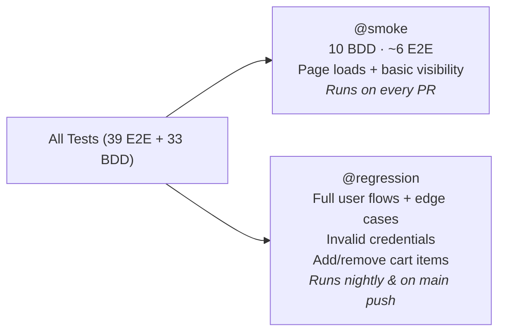

# FashionHub Test Suite — Architecture Diagram

## 🏗️ Overall Architecture

---

## 📁 Folder Structure

---

## 🧱 Component Relationships

---

## 🔄 CI/CD Pipeline

---

## 🏷️ Test Tag Strategy

---

## ⚡ npm Scripts Reference

| Command | What it runs |
|---|---|
| `npm run test:unit` | Vitest — 25 unit tests (103ms) |
| `npm run test:smoke` | Playwright `@smoke` only |
| `npm test` | Full Playwright suite |
| `npm run test:bdd` | All 33 Cucumber scenarios |
| `npm run test:bdd:smoke` | Cucumber `@smoke` scenarios |
| `npm run test:bdd:regression` | Cucumber `@regression` scenarios |
| `npm run lint` | ESLint check |
| `npm run format` | Prettier write |
